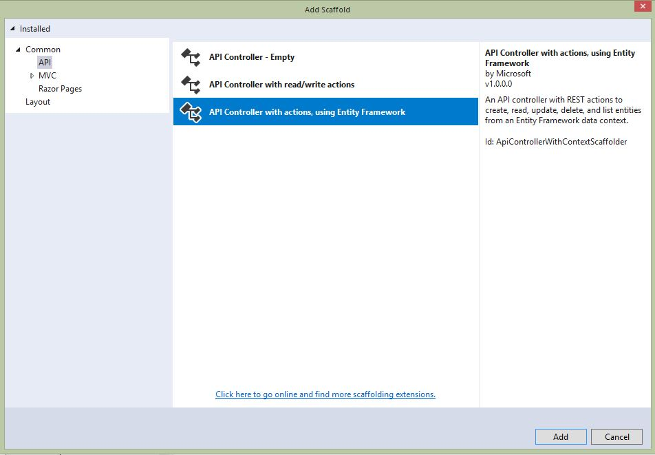
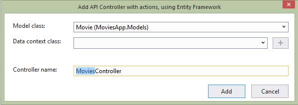

# Base Application

The base application is started with a standard .NET Core application.  Dependencies such as `NoDB`, `Vue.js` and `axios` were added (this is not a complete list).
Some additional tweaks were made to bring in custom SASS, and setup WebPack.  

To create the API, we first created an entity/model in the `Models` directory, as `Movie.cs`
```C#
using System;
using System.Collections.Generic;
using System.Linq;
using System.Threading.Tasks;

namespace MoviesApp.Models
{
    public class Movie
    {
        public int Id { get; set; }
        public string Title { get; set; }
        public int Year { get; set; }
        public string Director { get; set; }
        public string Description { get; set; }
    }
}
```

Next, we used the wizard in Visual Studio to automatically build the API controller. This is done by right clicking on the `Controllers` folder and selecting `Add` then `New Scaffolded Item...`


Select `API` on the left side and the option for `API Controller with actions, using Entity Framework` and click `Add`

On the next screen, select your new Model, in our case `Movie` from the drop down. The Controller name should be automatically set to `MoviesController` and click `Add`


Further modififications were made to implement `NoDB` along with memory cache.  These changes are not covered in this tutorial.