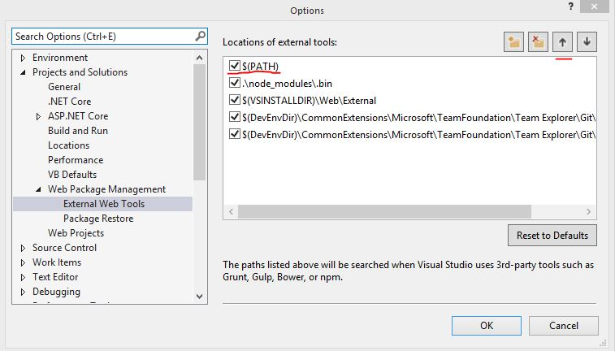

# Node-Sass Error
If you are unable to build the application, or the task runner for webpack is failing related to a `missing binding` and `node-sass`, please following these instructions

# Change the order of external tools
1. Navigate to 
`Tools` -> `Options...` -> `Projects and Solutions` -> `Web Package Mangement` -> `External Web Tools`
2. Use the up arrow to moev `$(PATH)` to the top of the list

# Rebuild node-sass
1. Open the Package Manager Console through `View` -> `Other Windows` -> `Package Manager Console`
2. Type `cd MoviesApp` and enter
3. Type `npm rebuild node-sass` and enter