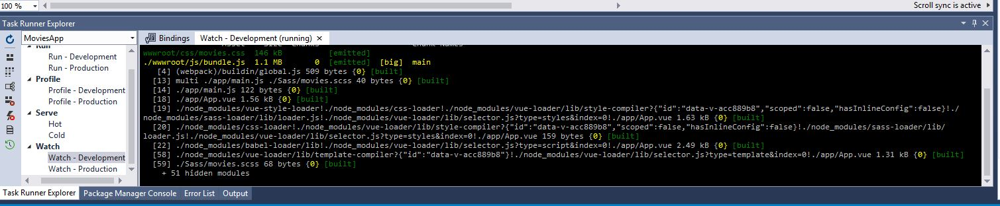

# Webpack Task Runner
This extension will allow you to make changes to your `Vue.js` files and see them reflected in your browser in real-time.
1. [Download](https://marketplace.visualstudio.com/items?itemName=MadsKristensen.WebPackTaskRunner) and Install the extension
2. Open the Solution
3. In Visual Studio, navigate to the `View` menu, then `Other Windows`, then `Task Runner Explorer`
4. Select `Watch - Development` by double clicking it
   1. If you do not see the "Watch - Development", click the `Refresh` icon

You will need to do this every time your open Visual Studio and open the solution.

